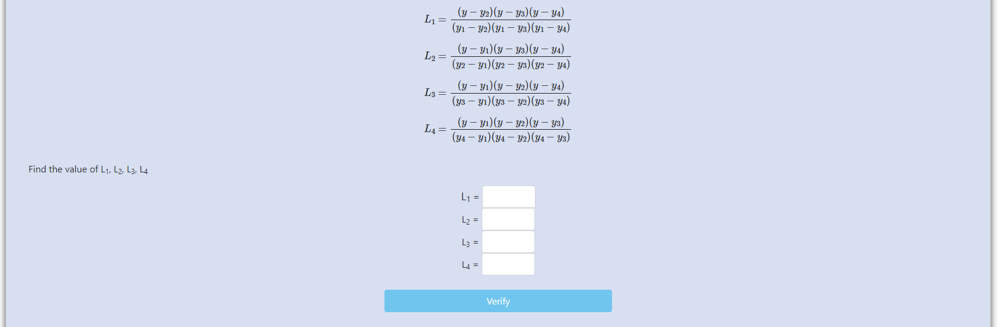
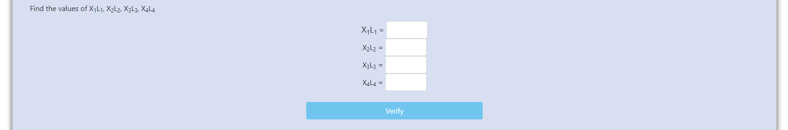
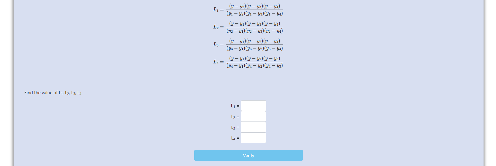
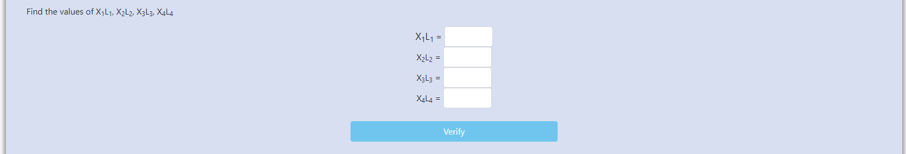

<h3><b>Step 1:</b> Click on "Next" </h3>

 
 

<h3><b>Step 2:</b> Find L1, L2, L3 and L4 </h3>

<h3>then click on "Verify"</h3>

 
 

<h3><b>Step 3:</b> Find X1L1, X2L2, X3L3 and X4L4 </h3>

<h3>then click on "Verify"</h3>

 
 

<h3><b>Step 4:</b> Calculate X</h3>

<h3>then click on "Verify"</h3>

 
 

<h3><b>Activity 2</b></h3>

<h3><b>Step 5:</b> Find L1, L2, L3 and L4
</h3>

<h3>then click on "Verify"</h3>

 
 

<h3><b>Step 6:</b> Find X1L1, X2L2, X3L3 and X4L4 </h3>

<h3>then click on "Verify"</h3>

 
 

<h3><b>Step 7:</b> Calculate X </h3>

<h3>then click on "Verify" and then on "Next"</h3>
<h3>Experiment completed.</h3>